# AI Interview Coach -- System Architecture

## High-Level Architecture Diagram

```mermaid
flowchart TD
    %% ── FRONTEND ──────────────────────────────────────
    subgraph Client["Frontend -- Next.js 16 / React 19"]
        Setup["InterviewSetup<br/>role, company, type, difficulty"]
        SessionUI["InterviewSession<br/>voice UI + transcript"]
        FaceTracker["FaceTracker<br/>MediaPipe WASM<br/>468 landmarks, emotions, gaze"]
        ReportUI["FeedbackReport<br/>Recharts radar + scores"]
        FaceTracker -.->|"snapshots ~2s"| SessionUI
    end

    %% ── ORCHESTRATION ─────────────────────────────────
    subgraph Orchestrator["Orchestration Layer -- FastAPI Routers"]
        StartFlow["POST /start -- Session Orchestrator<br/>create session > init agent > RAG enrich ><br/>LLM opening Q > TTS synth > persist"]
        TurnFlow["POST /respond/id -- Turn Orchestrator<br/>STT > tone analyze > state update ><br/>RAG refresh > LLM follow-up > TTS > persist"]
        FeedbackFlow["POST /generate/id -- Feedback Orchestrator<br/>load session > content eval > comm agg ><br/>body lang agg > weighted score > persist"]
        FaceEndpoint["POST /face-data/id<br/>receive batched face frames"]
    end

    Setup -->|HTTP| StartFlow
    SessionUI -->|"audio blob"| TurnFlow
    SessionUI -->|"batched frames"| FaceEndpoint
    FeedbackFlow -->|"report JSON"| ReportUI

    %% ── INTERVIEW AGENT ──────────────────────────────
    subgraph IntAgent["InterviewAgent -- stateful, per-session"]
        ConvHistory["Conversation History<br/>full prompt-level messages<br/>persisted to DB for reconstruction"]
        PromptBuilder["Dynamic Prompt Assembly<br/>base template + RAG context<br/>+ interview state + tone signals"]
        AgentState["InterviewState<br/>questions asked / remaining<br/>topics covered / remaining<br/>difficulty: easy / medium / hard<br/>tone trend: improving / stable / declining<br/>running WPM, filler, energy avgs"]
        DiffAdapt["Adaptive Difficulty<br/>adjusts based on answer quality"]
        RetryLogic["Retry -- tenacity<br/>3 attempts, exp backoff 2-10s"]
        ConvHistory --> PromptBuilder
        AgentState --> PromptBuilder
        AgentState --> DiffAdapt
    end

    TurnFlow --> IntAgent
    StartFlow --> IntAgent

    %% ── SENSOR AGENTS ────────────────────────────────
    subgraph Sensors["Sensor Agents -- per-turn analysis"]
        ToneAgent["ToneAnalyzer -- librosa, local<br/>WPM, fillers, pitch, prosody,<br/>jitter, shimmer, energy, silence"]
        FaceAgent["FaceAggregator<br/>eye contact %, emotion dist<br/>fidgeting score, temporal trends"]
    end

    TurnFlow --> ToneAgent
    ToneAgent -->|"ToneSnapshot"| AgentState
    ToneAgent -->|"tone signals"| PromptBuilder

    %% ── FEEDBACK ENGINE ──────────────────────────────
    subgraph FeedAgent["FeedbackEngine -- evaluation agent"]
        ContentEval["Content Evaluator<br/>LLM grades relevance,<br/>specificity, structure 0-10<br/>+ RAG benchmark comparison"]
        CommEval["Communication Evaluator<br/>aggregated tone metrics:<br/>pace, fillers, clarity, confidence<br/>+ 1st vs 2nd half trends"]
        BodyEval["Body Language Evaluator<br/>aggregated face metrics:<br/>eye contact, emotions, fidgeting<br/>+ temporal trends"]
        Scorer["Weighted Scorer<br/>content 50% + comm 25% + body 25%<br/>strengths, improvements, action items"]
        ContentEval --> Scorer
        CommEval --> Scorer
        BodyEval --> Scorer
    end

    FeedbackFlow --> FeedAgent
    ToneAgent -->|"all ToneSnapshots"| CommEval
    FaceAgent -->|"all FaceSnapshots"| BodyEval

    %% ── KNOWLEDGE / RAG ──────────────────────────────
    subgraph KnowledgeLayer["Knowledge Layer -- Hybrid RAG"]
        RAGRetriever["RAGRetriever -- singleton"]
        GraphSearch["Graph Traversal<br/>Company > Question<br/>Role > Question<br/>Topic > Question"]
        VectorSearch["Vector Similarity<br/>sentence-transformers<br/>all-MiniLM-L6-v2, 384-dim"]
        IntCtx["InterviewContext<br/>graph + vector questions<br/>+ company info"]
        FeedCtx["FeedbackContext<br/>example answers + similar Qs<br/>quality benchmarks"]
        RAGRetriever --> GraphSearch
        RAGRetriever --> VectorSearch
        GraphSearch --> IntCtx
        VectorSearch --> IntCtx
        VectorSearch --> FeedCtx
    end

    IntAgent -->|"get_interview_context()"| RAGRetriever
    ContentEval -->|"get_feedback_context()"| RAGRetriever
    KnowledgeLayer --> Neo4j["Neo4j AuraDB<br/>optional, graceful fallback"]

    %% ── PROVIDER ABSTRACTION ─────────────────────────
    subgraph ProviderLayer["Provider Abstraction -- factory + .env swap"]
        LLMProv["LLMProvider -- ABC<br/>Gemini | OpenAI | Claude | Ollama"]
        STTProv["STTProvider -- ABC<br/>Whisper Local | Whisper API | Deepgram | Google"]
        TTSProv["TTSProvider -- ABC<br/>edge-tts | OpenAI TTS | ElevenLabs | Google"]
    end

    IntAgent -->|"chat() with retry"| LLMProv
    ContentEval -->|"chat_json()"| LLMProv
    TurnFlow -->|"transcribe()"| STTProv
    TurnFlow -->|"synthesize()"| TTSProv
    StartFlow -->|"synthesize()"| TTSProv

    %% ── PERSISTENCE ──────────────────────────────────
    subgraph Persistence["Persistence Layer"]
        SessionStore["SessionStore<br/>dual-write: TTL cache + DB"]
        AgentCache["Agent Cache<br/>TTLCache max=100, ttl=1h<br/>auto-rebuild from DB on miss"]
        DB[("SQLAlchemy Async<br/>SQLite dev / PostgreSQL prod")]
        SessionStore --> DB
        AgentCache -->|"cache miss rebuild"| DB
    end

    Orchestrator --> SessionStore
    Orchestrator --> AgentCache

    %% ── STYLES ───────────────────────────────────────
    classDef client fill:#e3f2fd,stroke:#1565c0,color:#0d47a1
    classDef orch fill:#fff8e1,stroke:#f9a825,color:#5d4037
    classDef agent fill:#fce4ec,stroke:#c62828,color:#b71c1c
    classDef sensor fill:#f3e5f5,stroke:#6a1b9a,color:#4a148c
    classDef feedback fill:#fff3e0,stroke:#e65100,color:#bf360c
    classDef rag fill:#e8f5e9,stroke:#2e7d32,color:#1b5e20
    classDef provider fill:#e0f2f1,stroke:#00695c,color:#004d40
    classDef persist fill:#efebe9,stroke:#4e342e,color:#3e2723
    classDef extdb fill:#eceff1,stroke:#37474f,color:#263238

    class Client,Setup,SessionUI,FaceTracker,ReportUI client
    class Orchestrator,StartFlow,TurnFlow,FeedbackFlow,FaceEndpoint orch
    class IntAgent,ConvHistory,PromptBuilder,AgentState,DiffAdapt,RetryLogic agent
    class Sensors,ToneAgent,FaceAgent sensor
    class FeedAgent,ContentEval,CommEval,BodyEval,Scorer feedback
    class KnowledgeLayer,RAGRetriever,GraphSearch,VectorSearch,IntCtx,FeedCtx rag
    class ProviderLayer,LLMProv,STTProv,TTSProv provider
    class Persistence,SessionStore,AgentCache,DB persist
    class Neo4j extdb
```



---

## Architectural Components

### Orchestration Layer

The FastAPI routers act as the orchestrator, defining multi-step pipelines that coordinate the agents:

- **Session Orchestrator** (`POST /start`) -- Creates the session, initializes the InterviewAgent with state tracking, runs RAG enrichment, generates the opening question via LLM, synthesizes TTS audio, and persists everything to the database.
- **Turn Orchestrator** (`POST /respond/{id}`) -- Runs a 7-step pipeline per turn: STT transcribe -> tone analyze -> update interview state -> RAG refresh -> LLM follow-up with injected signals -> TTS synthesize -> persist. Each step has its own timeout (STT: 30s, LLM: 45s, TTS: 30s).
- **Feedback Orchestrator** (`POST /generate/{id}`) -- Coordinates three parallel evaluation streams (content, communication, body language), merges them with a weighted scorer, and persists the final report.

### Agentic Layer

#### InterviewAgent (stateful, per-session)

The core conversational agent. One instance per active interview session, cached in a TTLCache (max 100, 1-hour expiry) and automatically reconstructable from the database on cache miss or server restart.

- **Conversation History** -- Full prompt-level message list (not just transcript text). Persisted to DB via `agent_messages_json` so reconstruction preserves tone signal blocks, RAG context, and template structure.
- **InterviewState** -- Lightweight dataclass tracking questions asked/remaining, topics covered/remaining, current difficulty (easy/medium/hard), running tone averages (WPM, fillers, energy), and temporal trend detection (improving/stable/declining).
- **Tone Signal Injection** -- Each follow-up prompt includes a `[Candidate signals]` block with the latest WPM, filler count, energy level, and silence ratio. Coaching hints are appended (e.g., "candidate seems low-energy, consider an encouraging follow-up").
- **Adaptive Difficulty** -- Difficulty adjusts up/down based on LLM-assessed answer quality signals.
- **Dynamic Prompt Assembly** -- System prompt is rebuilt every turn from four parts: base template + RAG context block + interview state block + tone signal block.
- **Retry Logic** -- tenacity-based retry with 3 attempts, exponential backoff 2-10s, on transient LLM failures.

#### FeedbackEngine (evaluation agent)

Runs three analysis sub-pipelines after interview completion:

- **Content Evaluator** -- Sends the full transcript to the LLM with a structured JSON prompt. Requests scores for relevance, specificity, and structure (0-10). Enriches with RAG-retrieved example answers as quality benchmarks.
- **Communication Evaluator** -- Aggregates all ToneSnapshots into pace, clarity, filler, and confidence scores. Confidence uses a multi-factor formula (energy, pitch variation, jitter, rising intonation, pace). Includes prosody feedback (monotone delivery, uptalk detection, vocal stability). Runs temporal trend analysis (first half vs. second half energy and filler patterns).
- **Body Language Evaluator** -- Aggregates FaceSnapshots via FaceAggregator into eye contact %, emotion distribution (including focused/engaged detection), fidgeting score, and temporal trends.
- **Weighted Scorer** -- Content 50% + Communication 25% + Body Language 25%. Generates top 3 strengths, top 3 improvements, and up to 5 action items.

#### Sensor Agents

- **ToneAnalyzer** -- librosa-based, runs locally per turn with zero API cost. Extracts speaking pace (WPM), filler word detection (regex word-boundary matching with context-aware filtering for ambiguous words like "like" and "so"), pitch (average, variation, range), prosody analysis (rising intonation ratio for uptalk detection, monotone flag), voice quality metrics (jitter for pitch stability, shimmer for amplitude stability), energy (RMS with adaptive percentile-based normalization), and silence ratio.
- **FaceAggregator** -- Processes MediaPipe snapshots batched from the frontend. Computes eye contact percentage, emotion distribution (7 emotions: neutral, happy, confident, nervous, surprised, confused, focused -- classified from calibrated blendshape heuristics with temporal smoothing), fidgeting score (head pose variance), and temporal trends across interview halves.

### Knowledge Layer (Hybrid RAG)

`RAGRetriever` singleton combining two retrieval strategies:

- **Graph Traversal** -- Exploits structured Neo4j relationships (Company -> Question, Role -> Question, Topic -> Question) for precise, targeted context.
- **Vector Similarity** -- sentence-transformers (all-MiniLM-L6-v2, 384-dim) with cosine similarity. Background model loading to avoid blocking the first request. Finds semantically related questions and answers even without direct graph edges.

Produces two context types:
- `InterviewContext` -- graph + vector questions + company info, injected into the InterviewAgent system prompt.
- `FeedbackContext` -- example answers + similar questions, used by FeedbackEngine as quality benchmarks.

Falls back gracefully when Neo4j is unavailable (continues with static question bank only).

### Provider Abstraction

Factory pattern driven by `.env` variables. All external AI services are accessed through abstract base classes (`LLMProvider`, `STTProvider`, `TTSProvider`). Swap implementations by changing a single env var with zero code changes.

| Capability | Providers | Default |
|------------|-----------|---------|
| LLM | Gemini, OpenAI GPT-4o, Anthropic Claude, Ollama (local) | Gemini |
| STT | Whisper Local, Whisper API, Deepgram, Google STT | Whisper Local |
| TTS | edge-tts, OpenAI TTS, ElevenLabs, Google TTS | edge-tts |

### Persistence

- **SessionStore** -- Dual-write pattern: in-memory cache for fast reads + async SQLAlchemy writes for durability.
- **Agent Cache** -- TTLCache (maxsize=100, ttl=1h). On cache miss, the agent is automatically rebuilt from the DB-persisted session (including full prompt-level history and tone data replay).
- **Database** -- SQLAlchemy async ORM. SQLite for development, PostgreSQL for production. Models: `SessionRow`, `ReportRow`.
- **Neo4j AuraDB** -- Optional knowledge graph for RAG. System degrades gracefully without it.

---

## Per-Turn Data Flow

```
User speaks
    |
    v
[Browser AudioRecorder] --> audio blob
    |                         |
    |                    [MediaPipe FaceTracker] --> batched face snapshots
    v
POST /respond/{session_id}
    |
    |-- 1. STT Provider.transcribe(audio)         --> candidate_text     (30s timeout)
    |-- 2. ToneAnalyzer.analyze(audio)            --> ToneSnapshot       (local, no API)
    |-- 3. InterviewState.update_tone(snapshot)   --> updated state
    |-- 4. RAGRetriever.get_feedback_context()    --> follow-up RAG block
    |-- 5. InterviewAgent.generate_followup()     --> interviewer_text   (45s timeout, 3 retries)
    |       |-- Rebuild system prompt (base + RAG + state + tone signals)
    |       |-- LLM.chat(messages, system_prompt)
    |       |-- Sync messages to session for persistence
    |-- 6. TTS Provider.synthesize(interviewer_text) --> audio bytes     (30s timeout)
    |-- 7. SessionStore.update_session()          --> DB + cache write
    |
    v
Response: { transcript, interviewer_text, audio_url, tone_snapshot }
```
